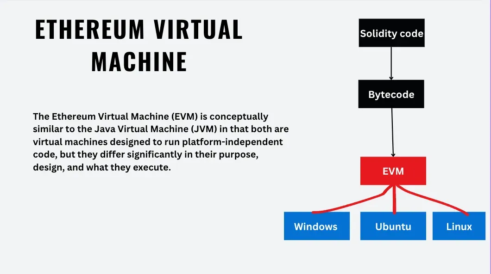

# In following repo, documenting the learning required for blockchain in 2025

## what is blockchain : 
- Blockchain is a decentralized, distributed, and often public, digital ledger **(Imagine a ledger as a diary, but for your money. It's a record of all your financial transaction)** consisting of records called blocks that are used to record transactions across many computers so that any involved block cannot be altered retroactively, without the alteration of all subsequent blocks. This allows the participants to verify and audit transactions independently and relatively inexpensively.   

## Key characteristics of blockchain:

Decentralization: No single entity controls the blockchain. It is distributed across a network of computers.   

Immutability: Once a transaction is recorded on the blockchain, it cannot be altered or deleted.   
Transparency: All transactions are publicly visible and verifiable.   

Security: Cryptography ensures the security of transactions and data.

## How does it work?

Transactions: Users initiate transactions, such as sending cryptocurrency or recording ownership of an asset.   

Verification: Nodes on the network verify the transaction's validity.  

Block creation: Verified transactions are grouped into blocks.   

Blockchain addition: The new block is added to the existing chain of blocks, creating a chronological record.

## Networks in blockchain : 
In the context of blockchain, a **network** refers to the interconnected system of computers (or nodes) that work together to maintain and operate the blockchain. 

Think of it like this:

* **Blockchain as the Library:** The blockchain itself is like a giant, decentralized library where all the financial transactions are recorded.
* **Network as the Librarians:** The network is made up of all the computers (nodes) that help manage this library. They:
    * **Verify transactions:** They check if transactions are valid and follow the rules of the blockchain.
    * **Maintain the ledger:** They store and update the blockchain with new transactions.
    * **Ensure security:** They use cryptography to protect the data and prevent tampering.

**Key points about blockchain networks:**

* **Decentralized:** No single entity controls the network. It's distributed among many computers.
* **Distributed ledger:** Each node in the network has a copy of the entire blockchain.
* **Consensus mechanism:** The network uses a set of rules (consensus mechanism) to agree on the order of transactions and maintain consistency.

**Types of Blockchain Networks:**

* **Public:** Anyone can join and participate in the network. (e.g., Bitcoin, Ethereum)
* **Private:** Access to the network is restricted to authorized members. (e.g., enterprise blockchains)
* **Consortium:** A mix of public and private, where a group of organizations controls the network.

**In essence, the network is the backbone of a blockchain, enabling its decentralized and secure operation.**

# Top network in blockchain : 

* Bitcoin (BTC): 2009
* Ethereum (ETH): 2015
* Binance Smart Chain (BSC): 2020 (though Binance Chain launched in 2019)
* Solana (SOL): 2019-2020
* Polkadot (DOT): 2019-2020

----------------------------------------------------------------------------------------

# Initial concept to master blockchain : 

## core concepts:  

* Blocks : 

* Hashing :

* Nodes : 

* Ledger : 

* events : 

* Wallets : 

* Decentralization : 

* Blockchain Types : 

* Blockchain Infrastructure :

* Governance Models : 

* Tokenization : 

* Consensus Mechanisms : 

* Smart Contracts : 

* Cryptography : 

* Cryptocurrencies :

* NFT : 

* development Tools and Technologies : 
    - Frameworks: Truffle, Hardhat, Remix for Ethereum.
    - Blockchain SDKs: Web3.js, Ethers.js, Polkadot.js.
    - Testing: Tools for simulating blockchain environments.
    - Blockchain Indexers: The Graph and Subgraph queries.

* Regulation : 

* Security Risks :

# intermediate and advanced concepts : 

* Blockchain Architecture: 
    - Forks
    - sharding
    - Layer 1 vs. Layer 2
    - Interoperability

* Smart Contracts (Advanced Topics)
    - Smart Contract Auditing
    - Gas Optimization
    - Oracles
    - Upgradeable Contracts

* Tokenomics and Cryptoeconomics
    - Token Standards
    - DeFi Concepts 
    - Stablecoins
    - Governance Tokens

* Privacy and Security :   

* Scaling and Optimization : 
-------------------------------------------------------------------------------------------------

# Development perspective Ethereum and Solana: 

* Blockchain Basics: Ledger structure, blocks, nodes, and transactions (covered above)

* Cryptography(covered above)

* Consensus Mechanisms & Types of Blockchain(covered above)

### **Ethereum Developer Topics**

#### **1. Fundamentals of Ethereum**
- Ethereum Virtual Machine (EVM): Core concepts and its role in smart contract execution.
- Gas: Gas fees, gas limits, and optimization techniques.
- Ethereum Accounts: Externally Owned Accounts (EOAs) vs. Contract Accounts.
- Ethereum Improvement Proposals (EIPs): Understanding their role (e.g., EIP-1559).

#### **2. Smart Contract Development**
- **Languages**:
  - Solidity: Core syntax, data types, control structures, and inheritance.
  - Vyper: An alternative smart contract language focused on security.
- **Development Tools**:
  - Remix IDE: Browser-based IDE for quick prototyping.
  - Truffle Suite: Framework for development, testing, and deployment.
  - Hardhat: Ethereum development environment with debugging tools.
- **Contract Deployment**:
  - Deployment techniques using Web3.js or Ethers.js.
  - Deploying to testnets (e.g., Goerli, Sepolia) and mainnet.
  
#### **3. Ethereum Libraries and APIs**
- Web3.js and Ethers.js: For interacting with Ethereum nodes and contracts.
- ABI (Application Binary Interface): Interfacing with deployed smart contracts.
- JSON-RPC: Ethereum’s communication protocol for nodes.

#### **4. Testing and Debugging**
- Unit Testing: Using Mocha, Chai, or Waffle for contract tests.
- Debugging: Tools like Ganache and Hardhat’s built-in debugging.

#### **5. Ethereum Token Standards**
- ERC-20: Fungible tokens.
- ERC-721: Non-fungible tokens (NFTs).
- ERC-1155: Multi-token standard (fungible + non-fungible).
- Extensions (e.g., ERC-4626 for vaults).

#### **6. Advanced Ethereum Development**
- Oracles: Integration with Chainlink for off-chain data.
- Multisig Wallets: Building and managing multisig wallets.
- Layer 2 Solutions: Using Arbitrum, Optimism, and zkSync.
- Gas Optimization: Reducing deployment and transaction costs.

#### **7. Ethereum Security**
- Common Vulnerabilities: Reentrancy, overflow, underflow, and delegate call attacks.
- Auditing Tools: MythX, Slither, and OpenZeppelin Defender.

#### **8. Decentralized Applications (dApps)**
- dApp Architecture: Smart contracts, front-end (React, Next.js), and back-end (Node.js).
- Wallet Integration: Connecting with MetaMask or WalletConnect.
- Event Handling: Listening to contract events in the UI.

---

### **Solana Developer Topics**

#### **1. Fundamentals of Solana**
- Solana Architecture: How Proof of History (PoH) and Tower BFT work.
- Solana Accounts: Account model and how state is stored.
- Solana Transactions: Structure, signing, and processing.
- Solana Clusters: Understanding mainnet, testnet, and devnet.

#### **2. Solana Development Tools**
- Solana CLI: For managing accounts, deploying programs, and interacting with the network.
- Anchor Framework: High-level framework for writing Solana programs.
- Rust: Core programming language for Solana smart contracts (programs).

#### **3. Solana Program Development**
- Program Structure: Entry points, instruction handling, and data serialization.
- Solana SDK: Using libraries like `solana_program` for development.
- Testing Programs: Unit tests and integration tests with Solana CLI or Anchor.

#### **4. Solana Token Standards**
- SPL Tokens: Solana’s equivalent to ERC-20.
- Metadata Standards: Token Metadata Program for NFTs.

#### **5. Advanced Solana Development**
- Cross-Program Invocation (CPI): Calling one program from another.
- Parallel Processing: How Solana handles concurrent transactions.
- Rent: Understanding Solana's rent model and rent exemption.
- PDAs (Program Derived Addresses): Managing off-chain interactions securely.

#### **6. Solana Security**
- Data Validation: Ensuring inputs are validated within programs.
- Secure Key Management: Handling private keys for deployment and interaction.
- Transaction Simulation: Debugging and testing with simulated transactions.

#### **7. Decentralized Applications on Solana**
- Front-End Integration: Using @solana/web3.js for dApps.
- Wallet Integration: Connecting with Phantom, Solflare, or Glow.
- On-Chain Programs: Deploying and interacting with programs.

---

### **Cross-Platform Skills**
- **Smart Contract Interoperability**: Bridging Ethereum and Solana (e.g., Wormhole).
- **Web3 Front-End Development**:
  - Using libraries like Web3Modal or React-based frameworks.
  - State management for blockchain-based applications.
- **Indexing and Querying**:
  - The Graph for Ethereum.
  - Solana Indexers (e.g., Helius, Anchor Explorer).
- **Testing**:
  - Mock environments for multi-chain dApps.
  - Performance testing for high-throughput use cases.
- **DevOps**:
  - Node setup and maintenance for Ethereum and Solana.
  - Deploying services to decentralized cloud platforms like Akash.

Projects list : 

learning Day2  :

# solana : 

  BPF Loader in solana

  Authority in Solana Programs
  
  Creating and revoking mint 
  
  (
- Solana accounts are like lockers that store data (up to 10MB) and require rent in SOL to maintain
- The System Program is responsible for creating new accounts, allocating space, and assigning program ownership
- BPF Loader Program manages custom programs (smart contracts) by deploying, upgrading, and executing them
- Authority in Solana refers to the account or person with permission to make decisions or perform actions in a program
- Different types of authorities exist, such as token mint authority, token freeze authority, and upgrade authority
- Mint authority can be created and revoked for tokens, affecting the ability to mint new tokens
  )

  solana consensus mechanism : 

  important links for solana developers : 

  understanding solana runtime : 

  solana networks : 

  solana explorer : 

  installing solana and other solana tools for building in solana eco system : 

  Types of client nodes : 

  Types of Nodes as a services : 

  difference between client nodes and nodes as a service :

  understanding solana RPC api : 

  understanding transation in solana : 

projects :
  creating wallet in solana in react : 

  creating first smart contract on solana

  create a react app and connecting it to rpc server to get solana account details : 

  creating a basic dapp in solana in solana : 

  miniting Token in solana

  miniting NFT in solana

  creating a cloud wallet in solana

  creating a bonkbot in sol

  writing 10 smart contract in solana to understand different concept for solana applications :

  creating a dapp for cross communication to different blockchain
    Frontend-Only DApp:
      A simple NFT viewer that fetches data directly from the blockchain and displays it.
      Requires a user wallet but minimal backend logic.

    Full DApp (Frontend + Backend):
      A DeFi lending platform where:
        The frontend provides the user interface for deposit, borrow, and repay actions.
        The backend consists of smart contracts deployed on a blockchain to manage transactions and balances.

    Hybrid DApp:
      A decentralized social media platform where:
        The blockchain backend handles post ownership and rewards.
        A centralized backend serves images or videos for performance optimization.
 
remaining topics : 

 difference between (common in all the blockchains): 
  
  * Bridges allow asset transfers across chains.
  * Oracles provide off-chain or cross-chain data to smart contracts.
  * Cross-chain messaging enables smart contracts to trigger actions across different chains. (cross chain communication)
  * Interoperable DeFi protocols allow interaction with DeFi applications on multiple blockchains.
  * RPC is a communication protocol for querying data from and interacting with blockchain nodes.

  difference between FT's and NFT's

  testing and debugging in solana : 

  solana networking

  solana performance and scalability : 

  solana security :

  deploying and monitoring solana app and smartcontract

  IPFS

  BonkBot

  Stacking

  LST(liquid stacking token)

  Indexer

  DEX and it's concepts : 

  wallets and it's concepts

  world state and it;s concepts

  Account types in solana and ethereum

  DEX vs CEX and it's internal concepts

  PDAs - Program Derived addresses , Solana Blockchain, Token Program, Mint Account and ATA

  important link to learn : 

  dapp : https://feather-lion-ff2.notion.site/Week-8-0-1-offline-107246afc9f28026a17bc87acf4f6e98
  

  https://petal-estimate-4e9.notion.site/Extra-session-Ideating-creating-and-publishing-your-first-Dapp-OS-work-9f8a24fe05bc47caaebb7c87ed70c338

  https://petal-estimate-4e9.notion.site/Web-3-Cohort-d1b49c992dbf4648b185f974523d127c

  https://github.com/orgs/100xdevs-cohort-3/repositories?

  https://www.canva.com/design/DAGWfh7FkYs/atPF0eKRrFcVvxIWs1R3Sw/edit

  # Solidity :

  EVM

   

  Keccak-256 and Remote Procedure Calls (RPC) and JSON-RPC

bitcoin white paper: https://bitcoin.org/bitcoin.pdf

ethereum white paper : https://ethereum.org/en/whitepaper/

solana white paper : https://solana.com/solana-whitepaper.pdf